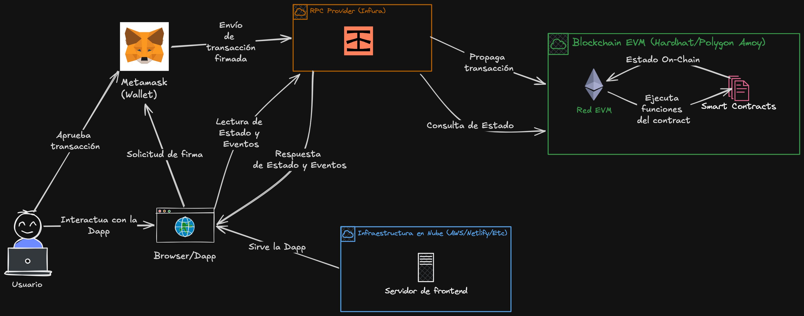
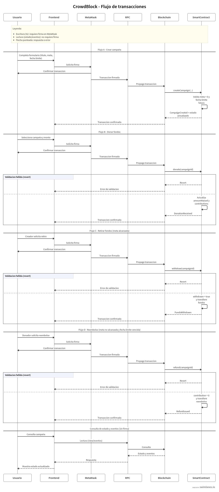
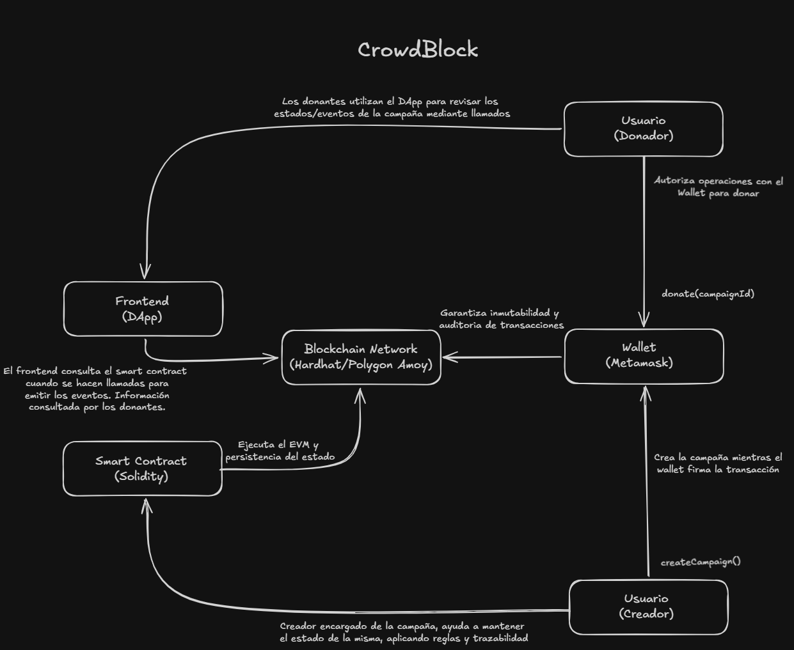

# CrowdBlock

Plataforma descentralizada de crowdfunding para crear campañas, recibir aportes y ejecutar retiros/reembolsos con reglas transparentes en blockchain.

## 1. Descripción del sistema

**CrowdBlock** es una DApp de crowdfunding donde una persona publica campañas con:
- Meta de recaudación
- Fecha límite

Las personas donantes envían fondos por medio de una criptomoneda directamente al smart contract.  
El contrato aplica reglas automáticas:
- La persona creadora puede retirar fondos solo si la campaña alcanzó la meta y no se retiró antes.
- Si la campaña finaliza sin alcanzar la meta, cada donante puede solicitar el reembolso de su aporte.

El objetivo es ofrecer una alternativa de financiamiento colectivo para usuarios reales, con transparencia, trazabilidad e inmutabilidad, sin intermediarios que custodien los fondos (a diferencia de plataformas tradicionales).

Para simplificar la primera versión, los aportes pueden manejarse en **POL (token nativo de Polygon)** y dejar como extensión futura el soporte de tokens **ERC-20**.

## 2. Arquitectura de la solución



La arquitectura de CrowdBlock se basa en un modelo de DApp por capas, donde el usuario interactúa desde el navegador con un frontend web que actúa como cliente de la aplicación. Para operaciones de
escritura en blockchain, el frontend solicita la firma de la transacción en MetaMask y luego la envía por RPC hacia la red EVM, donde el smart contract ejecuta las reglas de negocio y actualiza el estado on-chain.
Para operaciones de lectura, el frontend consulta estado y eventos directamente por RPC sin requerir firma. Esta separación entre lectura y escritura mejora la claridad del flujo, mantiene la seguridad en la
custodia de claves y permite desplegar el frontend como aplicación estática sin mover la lógica crítica fuera del contrato inteligente.

En desarrollo local con Hardhat, el RPC es local (por ejemplo `http://127.0.0.1:8545`) y no requiere Infura.  
En Amoy (testnet), puede usarse un proveedor RPC público o servicios como Infura/Alchemy.

### Capas
- **Frontend Web (DApp):** interfaz de usuario para crear campañas, donar, retirar y pedir reembolso.
- **Wallet (MetaMask):** firma de transacciones del usuario.
- **Smart Contract (Solidity):** lógica de negocio y estado en blockchain.
- **Red Blockchain:** Hardhat local y Polygon Amoy Testnet.

## 3. Flujo de transacciones



El diagrama de flujo de transacciones de CrowdBlock representa, en carriles separados, la interacción entre Usuario, Frontend, MetaMask, RPC, Blockchain y Smart Contract. Se detallan los cuatro
flujos principales del sistema: creación de campaña, donación, retiro de fondos por meta alcanzada y reembolso por meta no cumplida. El énfasis está en el camino funcional principal y en las
validaciones de permisos y estado del contrato (por ejemplo, quién puede retirar fondos y en qué condiciones). Además, se incluye el flujo de lectura de estado y eventos, el cual no requiere firma del wallet.

### Flujo A: Crear campaña
1. La persona creadora completa formulario (`title`, `goal`, `deadline`).
2. MetaMask firma la transacción.
3. El contrato ejecuta una función para crear una campaña `createCampaign()`.
4. Se valida que `goal > 0`, `deadline` sea futura y que el creador registrado sea `msg.sender`.
5. Se registra la campaña y se emite evento `CampaignCreated`.

### Flujo B: Donar fondos
1. La persona donante selecciona campaña y monto.
2. MetaMask firma transacción con valor (`msg.value`).
3. El contrato ejecuta `donate(campaignId)`.
4. Se valida que la campaña esté activa y dentro de plazo.
5. Se actualiza `amountRaised` y aporte acumulado del donante.
6. Se emite evento `DonationReceived`.

### Flujo C: Retirar fondos cuando se cumple la meta
1. La persona creadora solicita retiro.
2. MetaMask firma la transacción.
3. El contrato ejecuta `withdraw(campaignId)`.
4. Se valida:
   - Quien llama es la persona creadora.
   - `amountRaised >= goal`.
   - No se retiró antes.
5. Se marca `withdrawn = true` y se transfieren fondos.
6. Se emite evento `FundsWithdrawn`.

### Flujo D: Reembolso (meta no cumplida)
1. La persona donante solicita reembolso.
2. MetaMask firma la transacción.
3. El contrato ejecuta `refund(campaignId)`.
4. Se valida:
   - Fecha límite alcanzada.
   - `amountRaised < goal`.
   - Donante (`msg.sender`) tiene saldo aportado > 0.
5. Se pone su aporte en cero y se transfiere reembolso.
6. Se emite evento `RefundIssued`.

## 4. Componentes del sistema



### Componente 1: Usuario (Creador/Donador)
- Interactúa con la DApp.
- Autoriza operaciones con wallet.

### Componente 2: Frontend DApp
- Muestra campañas y estados.
- Prepara llamadas al contrato y lectura de eventos.
- No custodia fondos en sí.

### Componente 3: MetaMask
- Gestiona cuentas y llaves.
- Firma transacciones.
- Envía transacciones a la red.

### Componente 4: Smart Contract
- Mantiene estado de campañas y aportes.
- Aplica reglas de negocio.
- Emite eventos para trazabilidad.

### Componente 5: Blockchain (Hardhat / Polygon Amoy)
- Ejecuta EVM y persiste el estado.
- Garantiza inmutabilidad y auditoría de transacciones.

## 5. Modelo de datos propuesto

Estructura base de campaña:
- `id`
- `creator`
- `title`
- `goal`
- `deadline`
- `amountRaised`
- `withdrawn`

Estructura de aportes:
- `contributions[campaignId][donor] => amount`

## 6. Scripts de prueba funcional propuestos (.ts)

- `scripts/testCreateCampaign.ts`: crea campaña y valida campos iniciales.
- `scripts/testDonate.ts`: ejecuta donaciones y valida acumulado.
- `scripts/testWithdraw.ts`: valida retiro exitoso y fallos por permisos/estado.
- `scripts/testRefund.ts`: valida reembolso cuando no se alcanza meta y vence plazo.

## 7. Estructura base del repositorio inicial

```txt
CrowdBlock/
  contracts/
    Crowdfunding.sol
  scripts/
    deploy.ts
  web/
    (frontend de la DApp)...
  README.md
```
